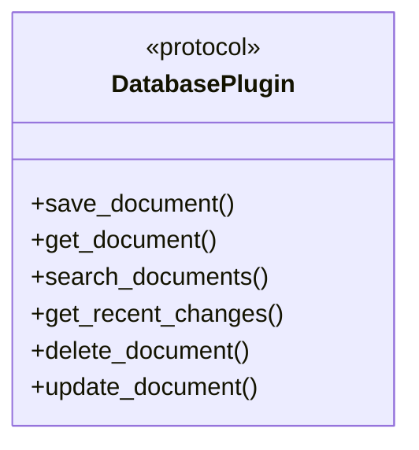
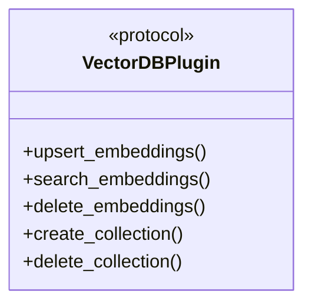
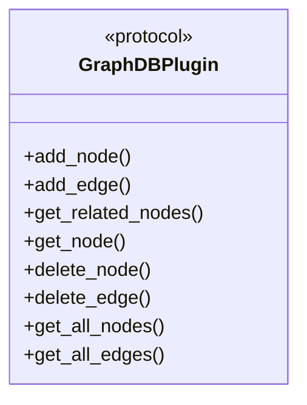
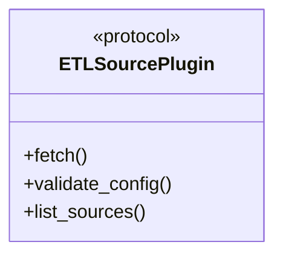
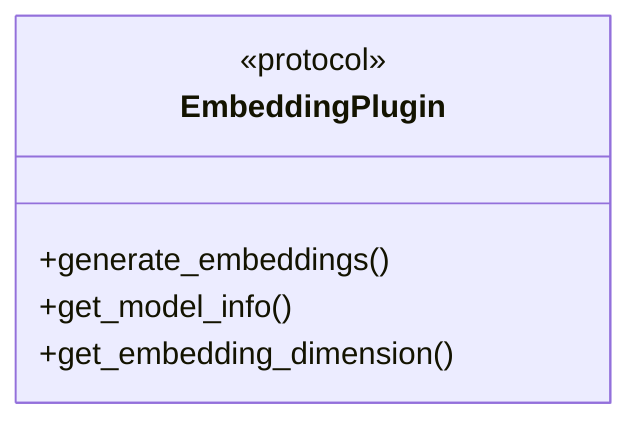
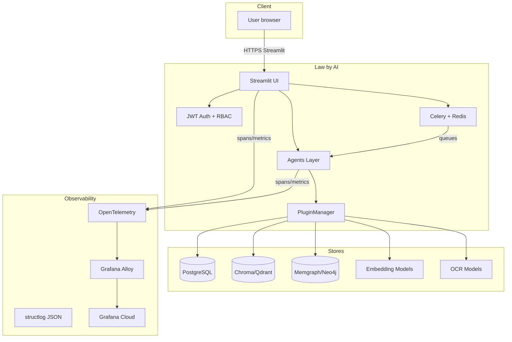
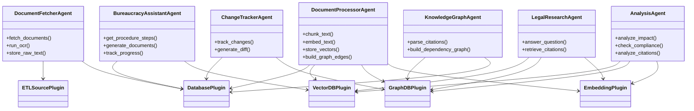
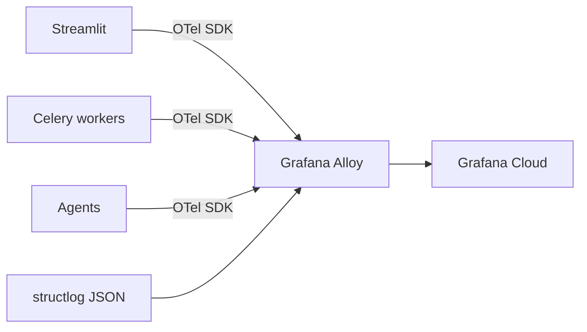
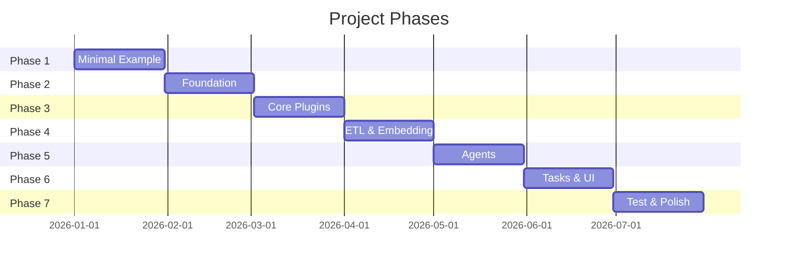

# System Architecture

> **Status:** Draft (Rev. 2) — reflects the revised architecture plan defined in
> the [Intention doc](intention.md) and tracked as **ADRs** in the
> [ADR Register](#adr-register) below.

---

## Overview

Law by AI is a self-hosted, multi-tenant platform for legal document ingestion,
processing, retrieval, and analysis. The system is built around a
**protocol-based plugin architecture** where five core plugin types (Database,
Vector DB, Graph DB, ETL Source, Embedding) are registered in a YAML config and
routed dynamically by a `PluginManager`.

All services run under Docker-Compose and communicate over the internal network.

> **Efficiency budget:** the whole stack must run **fast on ~4–6 GB RAM with a
> small local model (SLM)**. This constrains model choices, plugin
> implementations, and task design.

---

## Architecture Principles

1. **Protocols over ABCs** — plugins are defined as `typing.Protocol`s and
   registered via YAML; no inheritance hierarchy. (ADR-0001)
2. **Swappable backends** — every backend (DB, vector, graph, ETL, embedding)
   is replaceable without touching agent code.
3. **Efficiency first** — 4–6 GB RAM + SLM budget governs every decision.
4. **Observable by default** — `structlog` JSON + OTel metrics/traces, shipped
   via Grafana Alloy → Grafana Cloud, anonymized. (ADR-0005)
5. **Tenant-safe by construction** — multi-tenant isolation with automated
   leak tests. (ADR-0003)
6. **Resilient tasks** — Celery tasks with retry policies and in-DB failure
   monitoring. (ADR-0006)

---

## Plugin Architecture

The system defines **five plugin types**. Each is a **Protocol** (duck-typed
interface, no ABC inheritance). Concrete implementations are registered in
`config/plugins.yaml` and loaded by `PluginManager`. (ADR-0001)

### 1. DatabasePlugin (`core/plugins/protocols.py`)



**Default implementation**: PostgreSQL plugin (`plugins/postgresql.py`).
**MVP note**: shared document storage; per-tenant notes/states/chats isolated
via RLS (`tenant_id`). (ADR-0003)

### 2. VectorDBPlugin



**Default implementation**: Chroma (in-memory) for the MVP, Qdrant for
production (`plugins/chroma.py`, `plugins/qdrant.py`).

### 3. GraphDBPlugin



**Default implementation**: Memgraph plugin (`plugins/memgraph.py`) for the MVP.
**Production target**: Neo4j (`plugins/neo4j.py`). (ADR-0002)

### 4. ETLSourcePlugin



**Implementations**: Web ETL (`plugins/web_etl.py`), Git ETL (`plugins/git_etl.py`).

### 5. EmbeddingPlugin



**Default implementation**: Sentence Transformers (`plugins/sentence_transformers.py`),
model selected by evaluation on Polish legal texts. (ADR-0009)

### PluginManager (`core/plugins/manager.py`)

- **YAML registration** — plugin classes listed in `config/plugins.yaml` and
  loaded via `importlib`. (ADR-0001)
- **Type routing** — `get_plugin(type)` returns the correct initialized plugin.
- **Configuration-based** — plugin selection driven by `config/settings.py`.
- **Lifecycle** — `initialize()` → use → `close()` for clean shutdown.
- **Singleton** — global `plugin_manager` instance.

---

## Services



### 1. Streamlit UI

- **Role**: Primary user interface — fetch, browse, search, analysis, knowledge
  graph, changes tracking, bureaucracy assistant.
- **Pages planned**:
  - **Fetch Documents** (P1) — trigger ETL, upload files
  - **Browse Documents** (P1) — list, filter, view metadata
  - **Search** (P1) — keyword + semantic + hybrid, **faceted filters**
    (document type, dates, jurisdiction), **citations with confidence**
  - **Analysis** (P2) — impact, compliance, citation
  - **Knowledge Graph** (P2) — visual exploration
  - **Changes Tracking** (P2) — **Git-backed diff-based** version comparison
  - **Bureaucracy Assistant** (P1) — step-by-step administrative procedures
- **Auth**: all pages behind **JWT**; **RBAC** limits data management to
  `admin` (users read-only). (ADR-0004)
- **Frameworks**: Streamlit + custom components.
- **No public API** — API clients fetch data from the UI/backend directly.

### 2. Agents Layer

Each agent is a Python class that consumes one or more plugins via the
`PluginManager`. Agents are invoked by Celery tasks (async) or directly
from the UI (synchronous).



- **Execution model**: Human-in-the-loop — user triggers or approves each step.
- **Pre-configured pipelines** for the MVP.
- **MVP priority**: citations in LegalResearch/Analysis output; bureaucracy
  assistant delivered in MVP. (ADR-0008)

### 3. Celery + Redis

- **Role**: Async task queue for long-running operations (document fetching,
  processing, analysis).
- **Broker**: Redis.
- **Result backend**: Redis (MVP) → PostgreSQL (production).
- **Tasks**: Wrappers around agent methods (e.g., `fetch_document`,
  `process_document`, `track_changes`).
- **Efficiency**: task weights, timeouts, and concurrency tuned for the
  RAM budget.
- **Reliability (ADR-0006)**:
  - Retry policies with exponential backoff.
  - Failed tasks persisted to a **PostgreSQL `failed_tasks` table**.
  - UI exposes "re-run failed task" for any unprocessed/stuck in-DB task.

### 4. PostgreSQL

- **Role**: Primary relational store.
- **Stores**: Users, tenants, document metadata, text chunks, annotations,
  processing state, **failed-task registry**, full-text search index,
  per-tenant notes/chats.
- **Multi-tenancy**: row-level security (RLS) with `tenant_id`. (ADR-0003)
- **Accessed via**: `DatabasePlugin`.

### 5. Chroma (MVP) → Qdrant (Production)

- **Role**: Vector store for semantic search.
- **Data**: Document chunk embeddings.
- **Multi-tenant**: collection/partition per tenant.
- **MVP choice**: in-memory Chroma keeps RAM footprint low on 4–6 GB budget.
- **Accessed via**: `VectorDBPlugin`.

### 6. Memgraph (MVP) → Neo4j (Production)

- **Role**: Graph store for cross-reference tracking.
- **Data**: Law articles and their relationships (amends, refers-to, depends-on,
  cited-by).
- **MVP choice**: Memgraph — Cypher-compatible, low operational overhead.
- **Migration**: same `GraphDBPlugin` Protocol; export graph, swap config.
  (ADR-0002)
- **Accessed via**: `GraphDBPlugin`.

### 7. Embedding & OCR Models

- **EmbeddingPlugin** — local Sentence Transformers model, chosen by
  **evaluation on Polish legal texts**. (ADR-0009)
- **OCR** — model chosen by **evaluation on Polish documents**; runs inside
  `DocumentFetcherAgent` under the RAM budget.
- **LLM** — liteLLM proxy to **open-source lite models** (Gemma 4, Mistral
  Nano, Ministral, etc.). (ADR-0009)

---

## Observability (ADR-0005)

- **Logs**: `structlog` emitting **JSON**; PII is stripped at the source
  (anonymized).
- **Metrics**: counters/histograms (task duration, queue depth, search latency,
  error rates) exported via OTel.
- **Traces**: OpenTelemetry distributed tracing across UI → Celery → agents →
  plugins.
- **Export path**: OTel → **Grafana Alloy** → **Grafana Cloud**.
- **Privacy**: no tenant/user identifiers, document content, or query text in
  telemetry; tenant ID is hashed.



---

## Security (ADR-0004)

- **Authentication**: JWT issued at login; validated on every request.
- **Authorization (RBAC)**:
  - `admin` — manage data (ingest, edit, delete documents, manage users).
  - `user` — read-only (search, browse, query, diffs).
- **Multi-tenant isolation**: `tenant_id` enforced in every query path
  (PostgreSQL RLS, vector collection partitioning, graph subgraphs).
- **Automated leak tests** assert cross-tenant access is impossible.
  (ADR-0003)

---

## Data Flow

### Document Ingestion

```
Source (PDF / DOCX / HTML / Web / Git)
         │
         ▼
  ┌──────────────┐
  │ ETLSource    │  ← Web ETL Plugin / Git ETL Plugin
  │ Plugin       │
  └──────┬───────┘
         │ raw text
         ▼
  ┌──────────────────┐
  │ DocumentFetcher  │  ← Agent (via Celery task) + OCR
  │ Agent            │
  └──────┬───────────┘
         │ LegalDocument
         ▼
  ┌──────────────────┐
  │ DatabasePlugin   │  → PostgreSQL (save document metadata)
  └──────┬───────────┘
         │
         ▼
  ┌──────────────────┐
  │ DocumentProcessor│  ← Agent
  │ Agent            │
  └──┬───────┬───────┘
     │       │
     ▼       ▼
  Embedding    Graph
  Plugin      Plugin
     │           │
     ▼           ▼
  VectorDB    GraphDB     Database
  Plugin      Plugin      Plugin
  (Chroma/    (Memgraph/  (PG: chunks)
   Qdrant)     Neo4j)
```

1. **ETL Source Plugin** fetches raw text from the source (web, Git, file, API).
2. **DocumentFetcherAgent** runs OCR if needed, wraps the result in a
   `LegalDocument` model, and persists it via `DatabasePlugin`.
3. **DocumentProcessorAgent** chunks the text, generates embeddings via
   `EmbeddingPlugin`, stores vectors via `VectorDBPlugin`, and builds graph
   edges via `GraphDBPlugin`.

### Search & Q&A

```
User Query
    │
    ▼
┌──────────────────────┐
│ Hybrid Retriever      │
│ (keyword + semantic   │
│  + faceted filters)   │
└──┬─────────┬──────────┘
   │         │
   ▼         ▼
Database   VectorDB
Plugin     Plugin
(Postgres  (Chroma/
 FTS)       Qdrant)
   │         │
   └────┬────┘
        ▼
┌──────────────┐
│ Re-ranker     │  (cross-encoder)
└──────┬───────┘
       │
       ▼
┌──────────────────┐
│ Graph-Guided     │  GraphDBPlugin (Memgraph/Neo4j traversal)
│ Multi-Hop        │
└──────┬───────────┘
       │
       ▼
┌──────────────────────────────────────┐
│ Context + Prompt → liteLLM → SLM     │
│ → Answer + Citations + Confidence    │
└──────────────────────────────────────┘
```

**MVP additions**: faceted filters (document type, dates, jurisdiction),
citations with confidence scores, and precision evaluation. (ADR-0008 / ADR-0009)

---

## Directory Structure

```
law_by_ai/
├── core/
│   ├── __init__.py
│   ├── plugins/
│   │   ├── __init__.py
│   │   ├── protocols.py     # Plugin Protocols (all 5 types)
│   │   ├── manager.py       # PluginManager (YAML-driven loading)
│   │   ├── exceptions.py    # Plugin-specific errors
│   │   └── utils.py         # Shared utilities
│   ├── security/
│   │   ├── auth.py          # JWT issue/verify
│   │   ├── rbac.py          # Role checks (admin/user)
│   │   └── tenant.py        # tenant_id context helpers
│   └── observability/
│       ├── logging.py       # structlog JSON config (anonymized)
│       ├── metrics.py       # OTel metrics
│       └── tracing.py       # OTel traces
├── plugins/                 # Concrete plugin implementations
│   ├── postgresql.py
│   ├── chroma.py
│   ├── qdrant.py
│   ├── memgraph.py
│   ├── neo4j.py
│   ├── web_etl.py
│   ├── git_etl.py
│   └── sentence_transformers.py
├── agents/
│   ├── document_fetcher.py
│   ├── document_processor.py
│   ├── legal_research.py
│   ├── change_tracker.py
│   ├── knowledge_graph.py
│   ├── analysis.py
│   └── bureaucracy_assistant.py
├── tasks/                   # Celery task definitions
│   ├── celery_app.py
│   ├── etl_tasks.py
│   └── failed_tasks.py      # in-DB failure registry + re-run
├── ui/                      # Streamlit pages
│   ├── app.py
│   ├── pages/
│   │   ├── fetch.py
│   │   ├── browse.py
│   │   ├── search.py
│   │   ├── analysis.py
│   │   ├── knowledge_graph.py
│   │   ├── changes.py
│   │   └── bureaucracy.py
│   └── components/
├── config/
│   ├── settings.py          # Environment-based configuration
│   ├── plugins.yaml         # Protocol → implementation registration
│   └── .env.example
├── data/                    # Data models
│   └── models.py            # LegalDocument, DocumentChunk, GraphNode,
│                            # AnalysisResult, FailedTask, Note/Chat
├── evals/                   # Model & retrieval evaluations
│   ├── embedding_evals.py   # Polish embedding model comparison
│   ├── ocr_evals.py         # Polish OCR model comparison
│   └── hybrid_search_evals.py  # precision/recall on legal queries
├── docker/
│   ├── Dockerfile
│   └── docker-compose.yml   # services + healthchecks
├── tests/
│   ├── test_plugins/
│   ├── test_agents/
│   ├── test_tasks/
│   └── test_security/       # auth, rbac, tenant leak tests
├── scripts/
├── docs/                    # mkdocs documentation
├── requirements.txt
└── README.md
```

---

## Multi-Tenant Isolation

- **Shared document storage** — documents live in shared tables/collections;
  access is scoped by `tenant_id`.
- **Per-tenant state** — notes, states, chats, and annotations are isolated
  per tenant.
- **PostgreSQL**: row-level security (RLS) keyed on `tenant_id`.
- **Chroma/Qdrant**: collection or partition per tenant.
- **Memgraph/Neo4j**: subgraph per tenant (label-based).
- Tenant context is threaded through agents and plugins via the `tenant_id`
  field and enforced by middleware.
- **Leak tests** (ADR-0003): automated tests assert no cross-tenant read/write.

---

## Data Model (Conceptual)

```
Tenant
  ├── User (role: admin | user)
  ├── Document (LegalDocument)          [shared, tenant-scoped]
  │     ├── metadata (title, date, source, type, jurisdiction)
  │     ├── Chunk[] (DocumentChunk)
  │     │     ├── text
  │     │     ├── embedding (→ VectorDBPlugin)
  │     │     └── position (page, offset)
  │     └── GraphNode (→ GraphDBPlugin)
  │            ├── article_id
  │            └── relationships: amends, refers-to, depends-on, cited-by
  ├── Citation (law, article, paragraph, confidence, source_url)
  ├── Note / Chat / State              [per-tenant]
  ├── FailedTask                       [re-run registry]
  └── Query / Session log
```

---

## Technology Stack

| Layer            | MVP                          | Production                |
|------------------|------------------------------|---------------------------|
| **UI**           | Streamlit                    | Streamlit                |
| **Auth**         | JWT + RBAC                   | JWT + RBAC               |
| **Task queue**   | Celery + Redis               | Celery + Redis           |
| **Plugin system**| Protocol + YAML registration | Protocol + YAML          |
| **Relational DB**| PostgreSQL (DatabasePlugin)  | PostgreSQL               |
| **Vector store** | Chroma (in-memory)           | Qdrant                   |
| **Graph store**  | Memgraph                     | Neo4j                    |
| **Embeddings**   | Sentence Transformers (eval-selected) | Same           |
| **OCR**          | Tesseract/EasyOCR (eval-selected)     | Same           |
| **LLM gateway**  | liteLLM → open-source SLMs (Gemma 4, Mistral Nano, Ministral) | Same |
| **Observability**| structlog JSON + OTel → Grafana Alloy → Grafana Cloud | Same |
| **Health checks**| Docker healthchecks per service | Same + probes           |
| **Deployment**   | Docker-Compose               | Docker-Compose           |

---

## Implementation Phases

The work is tracked in [7 milestones](https://github.com/Stihotvor/law_by_ai/milestones):



---

## Migration Paths

1. **Plugin implementations** can be swapped without changing agent code — the
   `PluginManager` + Protocol abstraction makes each backend replaceable.
2. **Chroma → Qdrant**: implement `QdrantPlugin` against the same
   `VectorDBPlugin` Protocol; re-embed/export and swap the YAML config.
3. **Memgraph → Neo4j**: implement `Neo4jPlugin` against the same
   `GraphDBPlugin` Protocol; export the graph and swap the config. (ADR-0002)
4. **Manual → Automated legal updates**: Celery Beat schedule replaces manual
   triggers.

---

## ADR Register

Significant architecture decisions are tracked as Architecture Decision
Records. See the [ADR index](adr/index.md) for full records.

| ADR | Title | Status |
|-----|-------|--------|
| [ADR-0001](adr/0001-plugin-architecture.md) | Protocol-based plugins with YAML registration | Proposed |
| [ADR-0002](adr/0002-graph-database.md) | Memgraph (MVP) → Neo4j (production) | Proposed |
| [ADR-0003](adr/0003-multi-tenancy.md) | Shared document storage, per-tenant state | Proposed |
| [ADR-0004](adr/0004-auth-rbac.md) | JWT auth + RBAC (admin/user) | Proposed |
| [ADR-0005](adr/0005-observability.md) | structlog + OTel → Grafana Alloy → Grafana Cloud | Proposed |
| [ADR-0006](adr/0006-celery-reliability.md) | Celery retries + in-DB failed-task registry + re-run | Proposed |
| [ADR-0007](adr/0007-document-diffs.md) | Git-backed document-level diffs | Proposed |
| [ADR-0008](adr/0008-mvp-scope.md) | Citations, filters, bureaucracy assistant in MVP | Proposed |
| [ADR-0009](adr/0009-model-evals.md) | Embedding/OCR/hybrid-search evaluation for Polish | Proposed |
| [ADR-0010](adr/0010-health-checks.md) | Container health checks | Proposed |
| [ADR-0011](adr/0011-sla-budget.md) | Efficiency budget (4–6 GB + SLM) and basic SLAs | Proposed |

---

## Future Considerations

- **Public API server** (FastAPI) for third-party integrations.
- **Additional plugin types** (e.g., notification plugin).
- **Annotations and comments** on documents.
- **Collaboration features** (shared tenants).
- **Multi-language UI** (Ukrainian, Polish).
- **Automated legal-update fetching** via Celery Beat.
