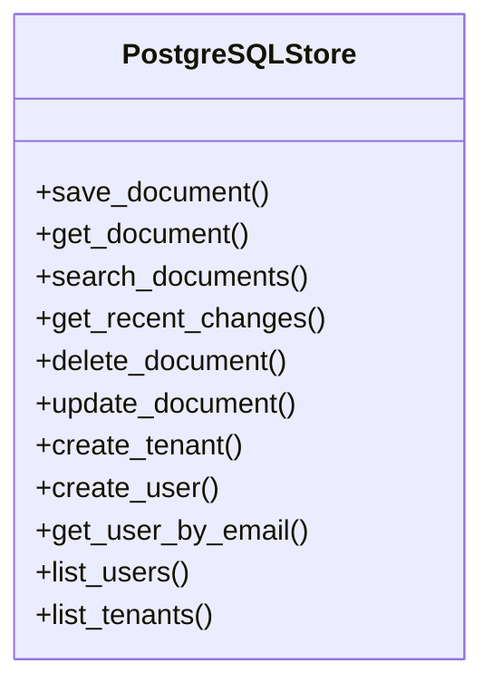
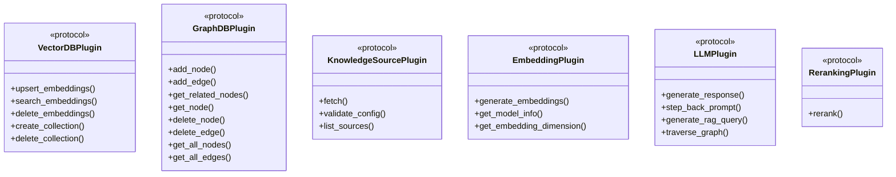
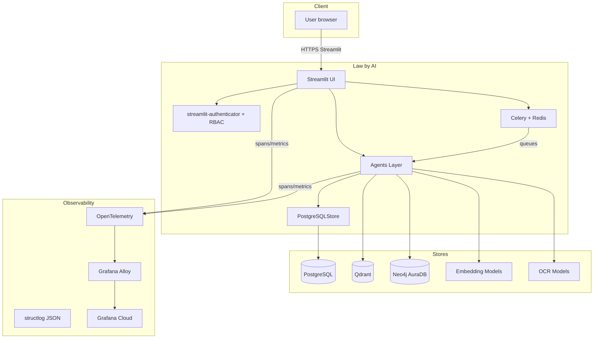
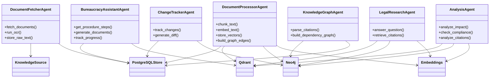
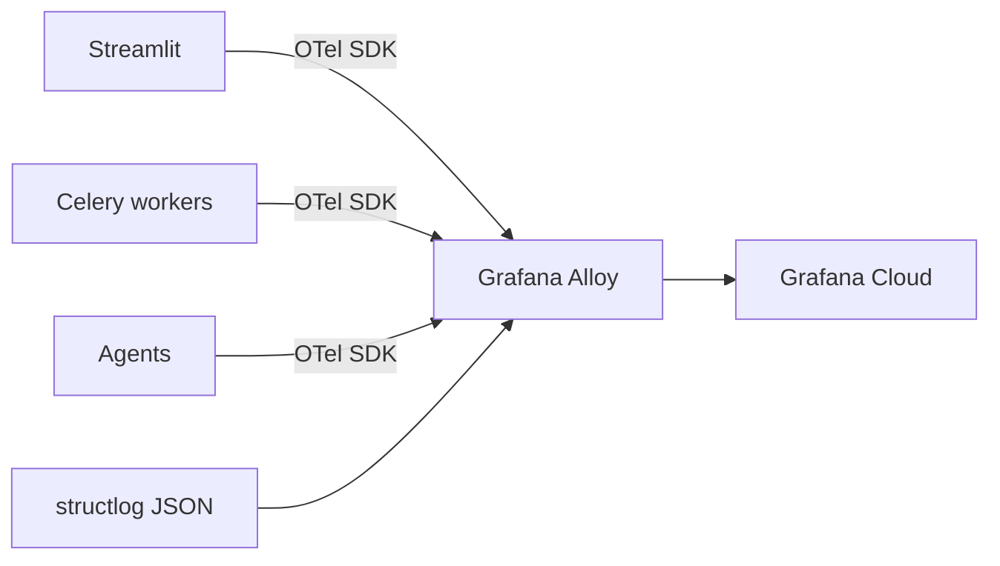
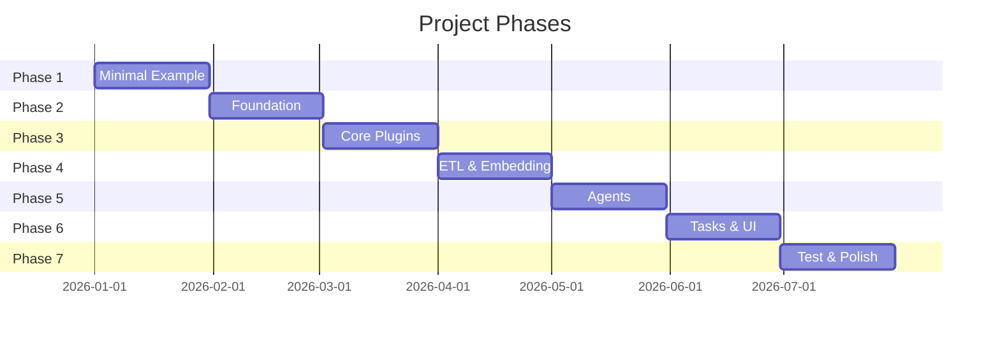

# System Architecture

> **Status:** Draft (Rev. 2) — reflects the revised architecture plan defined in
> the [Intention doc](intention.md) and tracked as **ADRs** in the
> [ADR Register](#adr-register) below.

---

## Overview

Law by AI is a self-hosted, multi-tenant platform for legal document ingestion,
processing, retrieval, and analysis. PostgreSQL is a **direct, hardcoded
integration** (ADR-0014); the protocol-based plugin system is **deprecated** and
each backend will become a direct dependency.

All services run under Docker-Compose and communicate over the internal network.

> **Efficiency budget:** the whole stack must run **fast on ~4–6 GB RAM with a
> small local model (SLM)**. This constrains model choices, integrations,
> and task design.

---

## Architecture Principles

1. **Direct integrations** — PostgreSQL (and later each store/model) is a
   hardcoded dependency, not a swappable plugin. (ADR-0014)
2. **Single provider per concern** — one relational store, one graph store, one
   vector store; avoid multi-backend abstractions a one-person project cannot
   maintain.
3. **Efficiency first** — the RAM/SLM budget governs every decision.
4. **Observable by default** — `structlog` JSON + OTel metrics/traces, shipped
   via Grafana Alloy → Grafana Cloud, anonymized. (ADR-0005)
5. **Tenant-safe by construction** — multi-tenant isolation with automated
   leak tests. (ADR-0003)
6. **Resilient tasks** — Celery tasks with retry policies and in-DB failure
   monitoring. (ADR-0006)

---

## PostgreSQL Integration (hardcoded, ADR-0014)

PostgreSQL is the single relational store, accessed directly via
`PostgreSQLStore` (`plugins/relational_db/postgres.py`) — no protocol
indirection. Schema is managed by **Alembic migrations** (issue #9); see
[Migrations](migrations.md) for commands.

### `PostgreSQLStore` (`plugins/relational_db/postgres.py`)



**MVP note**: shared document storage; per-tenant notes/states/chats isolated
via RLS (`tenant_id`). (ADR-0003)

### Deprecated plugin scaffolding

The remaining six plugin types (`VectorDB`, `GraphDB`, `KnowledgeSource`,
`Embedding`, `LLM`, `Reranking`) are **deprecated** per ADR-0014. Their
protocols, `PluginManager`, and `config/plugins.yaml` stay in the tree for
now but are phased out as each backend becomes a direct integration.
`config/plugins.yaml` has **no** active registrations.



Future direction (ADR-0014): each of these becomes a **direct integration**:

- **Graph**: Neo4j **AuraDB Free** (cloud-managed). (ADR-0002)
- **Vector**: Qdrant.
- **Knowledge sources**: web/git/filesystem ETL modules.
- **Embedding**: a dedicated embedding provider (may differ from the LLM provider).
- **LLM/SLM**: OpenAI-compatible endpoints; **each agent may use its own model**.
- **Reranking**: Cohere.

### PluginManager (`core/plugins/manager.py`) — deprecated

- **YAML registration** — plugin classes listed in `config/plugins.yaml` and
  loaded via `importlib`. (ADR-0001, superseded)
- **Type routing** — `get_plugin(type)` returns the correct initialized plugin.
- **Lifecycle** — `initialize()` → use → `close()` for clean shutdown.
- **Singleton** — global `plugin_manager` instance.

---

## Services



### 1. Streamlit UI

- **Role**: Primary user interface — fetch, browse, search, analysis, knowledge
  graph, changes tracking, bureaucracy assistant.
- **Pages planned**:
  - **Fetch Documents** (P1) — trigger ETL, upload files
  - **Browse Documents** (P1) — list, filter, view metadata
  - **Search** (P1) — keyword + semantic + hybrid, **faceted filters**
    (document type, dates, jurisdiction), **citations with confidence**
  - **Analysis** (P2) — impact, compliance, citation
  - **Knowledge Graph** (P2) — visual exploration
  - **Changes Tracking** (P2) — **Git-backed diff-based** version comparison
  - **Bureaucracy Assistant** (P1) — step-by-step administrative procedures
- **Auth**: all pages behind **streamlit-authenticator** (login widget,
  bcrypt, signed session cookie); **RBAC** limits data management to
  `admin` (users read-only). (ADR-0013, ADR-0004)
- **Frameworks**: Streamlit + custom components.
- **No public API** — API clients fetch data from the UI/backend directly.

### 2. Agents Layer

Each agent is a Python class that consumes the direct integrations
(`PostgreSQLStore` today; later Qdrant, Neo4j, LLM/embedding clients). Agents
are invoked by Celery tasks (async) or directly from the UI (synchronous).



- **Execution model**: Human-in-the-loop — user triggers or approves each step.
- **Pre-configured pipelines** for the MVP.
- **MVP priority**: citations in LegalResearch/Analysis output; bureaucracy
  assistant delivered in MVP. (ADR-0008)

### 3. Celery + Redis

- **Role**: Async task queue for long-running operations (document fetching,
  processing, analysis).
- **Broker**: Redis.
- **Result backend**: Redis (MVP) → PostgreSQL (production).
- **Tasks**: Wrappers around agent methods (e.g., `fetch_document`,
  `process_document`, `track_changes`).
- **Efficiency**: task weights, timeouts, and concurrency tuned for the
  RAM budget.
- **Reliability (ADR-0006)**:
  - Retry policies with exponential backoff.
  - Failed tasks persisted to a **PostgreSQL `failed_tasks` table**.
  - UI exposes "re-run failed task" for any unprocessed/stuck in-DB task.

### 4. PostgreSQL (direct, ADR-0014)

- **Role**: Primary relational store.
- **Stores**: Users, tenants, document metadata, text chunks, annotations,
  processing state, **failed-task registry**, full-text search index,
  per-tenant notes/chats.
- **Multi-tenancy**: row-level security (RLS) with `tenant_id`. (ADR-0003)
- **Schema**: managed by **Alembic migrations** (issue #9) — see
  [Migrations](migrations.md).
- **Accessed via**: `PostgreSQLStore` directly.

### 5. Qdrant

- **Role**: Vector store for semantic search.
- **Data**: Document chunk embeddings.
- **Multi-tenant**: collection/partition per tenant.
- **Integration**: direct client (ADR-0014; VectorDBPlugin deprecated).

### 6. Neo4j AuraDB (cloud-managed)

- **Role**: Graph store for cross-reference tracking.
- **Data**: Law articles and their relationships (amends, refers-to, depends-on,
  cited-by).
- **Hosting**: Neo4j **AuraDB Free** tier. (ADR-0002)
- **Integration**: direct client (ADR-0014; GraphDBPlugin deprecated).

### 7. Embedding, Reranking & LLM

- **Embedding** — dedicated embedding provider (may differ from the LLM
  provider); chosen by **evaluation on Polish legal texts**. (ADR-0009)
- **Reranking** — Cohere.
- **LLM/SLM** — **OpenAI-compatible endpoints**; each agent may use its own
  model (ADR-0014).
- **OCR** — model chosen by **evaluation on Polish documents**; runs inside
  `DocumentFetcherAgent` under the RAM budget.

---

## Observability (ADR-0005)

- **Logs**: `structlog` emitting **JSON**; PII is stripped at the source
  (anonymized).
- **Metrics**: counters/histograms (task duration, queue depth, search latency,
  error rates) exported via OTel.
- **Traces**: OpenTelemetry distributed tracing across UI → Celery → agents →
  integrations.
- **Export path**: OTel → **Grafana Alloy** → **Grafana Cloud**.
- **Privacy**: no tenant/user identifiers, document content, or query text in
  telemetry; tenant ID is hashed.



---

## Security (ADR-0004 / ADR-0013)

- **Authentication**: `streamlit-authenticator` login/logout widgets with
  signed session cookies; credentials come from the PostgreSQL user store
  (bcrypt-hashed passwords), with a bundled dev admin fallback. (ADR-0013)
- **Authorization (RBAC)**:
  - `admin` — manages data: ingest documents, edit/delete, manage users.
  - `user` — read-only: search, browse, query, view diffs.
- Enforced in a shared auth/RBAC layer (`core/security/`) used by the UI and
  agents; tenant context (`tenant_id`) is threaded from the authenticated
  session into the contextvar and query paths.
- **Multi-tenant isolation**: `tenant_id` enforced in every query path
  (PostgreSQL RLS, vector collection partitioning, graph subgraphs).
- **Automated leak tests** assert cross-tenant access is impossible.
  (ADR-0003)

---

## Data Flow

### Document Ingestion

```
Source (PDF / DOCX / HTML / Web / Git)
         │
         ▼
  ┌──────────────┐
  │ ETL Source   │  ← Web ETL / Git ETL
  │ Module       │
  └──────┬───────┘
         │ raw text
         ▼
  ┌──────────────────┐
  │ DocumentFetcher  │  ← Agent (via Celery task) + OCR
  │ Agent            │
  └──────┬───────────┘
         │ LegalDocument
         ▼
   ┌──────────────────┐
   │ PostgreSQLStore  │  → PostgreSQL (save document metadata)
   └──────┬───────────┘
         │
         ▼
  ┌──────────────────┐
  │ DocumentProcessor│  ← Agent
  │ Agent            │
  └──┬───────┬───────┘
     │       │
     ▼       ▼
  Embedding   Graph
  (direct)   (Neo4j)
     │           │
     ▼           ▼
   Qdrant     Neo4j      PostgreSQL
  (vectors)  (graph)    (chunks)
```

1. **ETL source module** fetches raw text from the source (web, Git, file, API).
2. **DocumentFetcherAgent** runs OCR if needed, wraps the result in a
   `LegalDocument` model, and persists it via `PostgreSQLStore`.
3. **DocumentProcessorAgent** chunks the text, generates embeddings via the
   embedding provider, stores vectors in Qdrant, and builds graph edges in Neo4j.

### Search & Q&A

```
User Query
    │
    ▼
┌──────────────────────┐
│ Hybrid Retriever      │
│ (keyword + semantic   │
│  + faceted filters)   │
└──┬─────────┬──────────┘
   │         │
   ▼         ▼
PostgreSQL  Qdrant
(FTS)       (vectors)
   │         │
   └────┬────┘
        ▼
┌──────────────┐
│ Re-ranker     │  Cohere (cross-encoder)
└──────┬───────┘
       │
       ▼
┌──────────────────┐
│ Graph-Guided     │  Neo4j AuraDB traversal
│ Multi-Hop        │
└──────┬───────────┘
       │
       ▼
┌──────────────────────────────────────┐
│ Context + Prompt → OpenAI-compatible │
│ → Answer + Citations + Confidence    │
└──────────────────────────────────────┘
```

**MVP additions**: faceted filters (document type, dates, jurisdiction),
citations with confidence scores, and precision evaluation. (ADR-0008 / ADR-0009)

---

## Directory Structure

```
law_by_ai/
├── core/
│   ├── __init__.py
│   ├── plugins/
│   │   ├── __init__.py
│   │   ├── protocols/       # DEPRECATED (ADR-0014): Plugin Protocols
│   │   │   ├── vector_db.py        # VectorDBPlugin (deprecated)
│   │   │   ├── graph_db.py         # GraphDBPlugin (deprecated)
│   │   │   ├── knowledge_source.py # KnowledgeSourcePlugin (deprecated)
│   │   │   ├── embedding.py        # EmbeddingPlugin (deprecated)
│   │   │   ├── llm.py              # LLMPlugin (deprecated)
│   │   │   ├── reranking.py        # RerankingPlugin (deprecated)
│   │   │   └── types.py            # Shared type aliases (JsonDict)
│   │   ├── manager.py       # PluginManager — deprecated (ADR-0014)
│   │   └── exceptions.py    # Plugin-specific errors
│   ├── security/
│   │   ├── auth.py          # JWT issue/verify
│   │   ├── rbac.py          # Role checks (admin/user)
│   │   └── tenant.py        # tenant_id context helpers
│   └── observability/
│       ├── logging.py       # structlog JSON config (anonymized)
│       ├── metrics.py       # OTel metrics
│       └── tracing.py       # OTel traces
├── plugins/                 # Direct integrations + deprecated plugin impls
│   └── relational_db/
│       └── postgres.py      # PostgreSQLStore (direct, ADR-0014)
├── agents/
│   ├── document_fetcher.py
│   ├── document_processor.py
│   ├── legal_research.py
│   ├── change_tracker.py
│   ├── knowledge_graph.py
│   ├── analysis.py
│   └── bureaucracy_assistant.py
├── tasks/                   # Celery task definitions
│   ├── celery_app.py
│   ├── etl_tasks.py
│   └── failed_tasks.py      # in-DB failure registry + re-run
├── ui/                      # Streamlit pages
│   ├── app.py
│   ├── pages/
│   │   ├── fetch.py
│   │   ├── browse.py
│   │   ├── search.py
│   │   ├── analysis.py
│   │   ├── knowledge_graph.py
│   │   ├── changes.py
│   │   └── bureaucracy.py
│   └── components/
├── config/
│   ├── settings.py          # Environment-based configuration
│   ├── plugins.py           # DEPRECATED plugin facade (ADR-0014)
│   ├── plugins.yaml         # DEPRECATED registry — no active entries
│   └── .env.example
├── migrations/              # Alembic migrations (issue #9)
│   ├── env.py
│   └── versions/
├── data/                    # Data models
│   └── models.py            # LegalDocument, DocumentChunk, GraphNode,
│                            # AnalysisResult, FailedTask, Note/Chat
├── evals/                   # Model & retrieval evaluations
│   ├── embedding_evals.py   # Polish embedding model comparison
│   ├── ocr_evals.py         # Polish OCR model comparison
│   └── hybrid_search_evals.py  # precision/recall on legal queries
├── docker/
│   ├── Dockerfile
│   └── docker-compose.yml   # services + healthchecks
├── tests/
│   ├── conftest.py          # global pytest config + pytest_plugins
│   ├── fixtures/            # shared pytest fixtures (auto-loaded)
│   ├── factories/           # fake classes + make_* builders
│   ├── unit/                # unit tests, no external services
│   │   ├── config/
│   │   └── plugins/
│   ├── integration/         # postgres/redis tests (marked `integration`)
│   └── e2e/                 # whole-stack tests
├── scripts/
├── docs/                    # mkdocs documentation
├── alembic.ini              # Alembic configuration
├── pyproject.toml           # project metadata, deps, ruff + pytest config
├── uv.lock                  # locked dependency graph (uv)
└── README.md
```

**Tooling note:** the project is managed by a **globally-installed `uv`**
(standalone installer). `uv` is not a project dependency — it manages `.venv`
from the OS level. See the repo root `CONTRIBUTING.md` for setup.

---

## Multi-Tenant Isolation

- **Shared document storage** — documents live in shared tables/collections;
  access is scoped by `tenant_id`.
- **Per-tenant state** — notes, states, chats, and annotations are isolated
  per tenant.
- **PostgreSQL**: row-level security (RLS) keyed on `tenant_id`.
- **Qdrant**: collection or partition per tenant.
- **Neo4j**: subgraph per tenant (label-based).
- Tenant context is threaded through agents and the data store via the
  `tenant_id` field and enforced by middleware.
- **Leak tests** (ADR-0003): automated tests assert no cross-tenant read/write.

---

## Data Model (Conceptual)

```
Tenant
  ├── User (role: admin | user)
  ├── Document (LegalDocument)          [shared, tenant-scoped]
  │     ├── metadata (title, date, source, type, jurisdiction)
  │     ├── Chunk[] (DocumentChunk)
  │     │     ├── text
  │     │     ├── embedding (→ Qdrant)
  │     │     └── position (page, offset)
  │     └── GraphNode (→ Neo4j)
  │            ├── article_id
  │            └── relationships: amends, refers-to, depends-on, cited-by
  ├── Citation (law, article, paragraph, confidence, source_url)
  ├── Note / Chat / State              [per-tenant]
  ├── FailedTask                       [re-run registry]
  └── Query / Session log
```

---

## Technology Stack

| Layer            | Choice                                                          |
|------------------|-----------------------------------------------------------------|
| **UI**           | Streamlit                                                        |
| **Auth**         | streamlit-authenticator + RBAC (ADR-0013)                        |
| **Task queue**   | Celery + Redis                                                   |
| **Relational DB**| PostgreSQL — direct integration + Alembic migrations (ADR-0014)  |
| **Vector store** | Qdrant                                                           |
| **Graph store**  | Neo4j **AuraDB Free** (cloud) (ADR-0002)                         |
| **Embeddings**   | Dedicated embedding provider (eval-selected, ADR-0009)           |
| **Reranking**    | Cohere                                                           |
| **LLM/SLM**      | OpenAI-compatible endpoints; per-agent models (ADR-0014)         |
| **OCR**          | Tesseract/EasyOCR (eval-selected, ADR-0009)                      |
| **Observability**| structlog JSON + OTel → Grafana Alloy → Grafana Cloud (ADR-0005) |
| **Health checks**| Docker healthchecks per service                                  |
| **Deployment**   | Docker-Compose                                                   |

---

## Implementation Phases

The work is tracked in [7 milestones](https://github.com/Stihotvor/law_by_ai/milestones):



---

## Migration Paths

1. **PostgreSQL schema** — managed by Alembic migrations (issue #9); see
   [Migrations](migrations.md).
2. **Plugin → direct integration** — each deprecated plugin type (VectorDB,
   GraphDB, LLM, Embedding, Reranking, KnowledgeSource) is replaced by a direct
   client as its integration lands. (ADR-0014)
3. **Manual → Automated legal updates**: Celery Beat schedule replaces manual
   triggers.

---

## ADR Register

Significant architecture decisions are tracked as Architecture Decision
Records. See the [ADR index](adr/index.md) for full records.

| ADR | Title | Status |
|-----|-------|--------|
| [ADR-0001](adr/0001-plugin-architecture.md) | Protocol-based plugins with YAML registration | Superseded by ADR-0014 |
| [ADR-0002](adr/0002-graph-database.md) | Neo4j AuraDB (production graph DB) | Proposed |
| [ADR-0003](adr/0003-multi-tenancy.md) | Shared document storage, per-tenant state | Proposed |
| [ADR-0004](adr/0004-auth-rbac.md) | JWT auth + RBAC (admin/user) — JWT superseded by ADR-0013, RBAC retained | Superseded | 2026-07-31 |
| [ADR-0005](adr/0005-observability.md) | structlog + OTel → Grafana Alloy → Grafana Cloud | Proposed |
| [ADR-0006](adr/0006-celery-reliability.md) | Celery retries + in-DB failed-task registry + re-run | Proposed |
| [ADR-0007](adr/0007-document-diffs.md) | Git-backed document-level diffs | Proposed |
| [ADR-0008](adr/0008-mvp-scope.md) | Citations, filters, bureaucracy assistant in MVP | Proposed |
| [ADR-0009](adr/0009-model-evals.md) | Embedding/OCR/hybrid-search evaluation for Polish | Proposed |
| [ADR-0010](adr/0010-health-checks.md) | Container health checks | Proposed |
| [ADR-0011](adr/0011-sla-budget.md) | Efficiency budget (4–6 GB + SLM) and basic SLAs | Proposed |
| [ADR-0012](adr/0012-license-contribution-model.md) | MIT license + contribution model (DCO, invite-only) | Proposed |
| [ADR-0013](adr/0013-streamlit-authenticator.md) | streamlit-authenticator for the core app (JWT replaced) | Accepted |
| [ADR-0014](adr/0014-hardcoded-postgresql.md) | Hardcoded PostgreSQL; plugin system deprecated | Accepted |

---

## Future Considerations

- **Public API server** (FastAPI) for third-party integrations.
- **Additional integrations** as features demand (e.g., notifications).
- **Annotations and comments** on documents.
- **Collaboration features** (shared tenants).
- **Multi-language UI** (Ukrainian, Polish).
- **Automated legal-update fetching** via Celery Beat.
